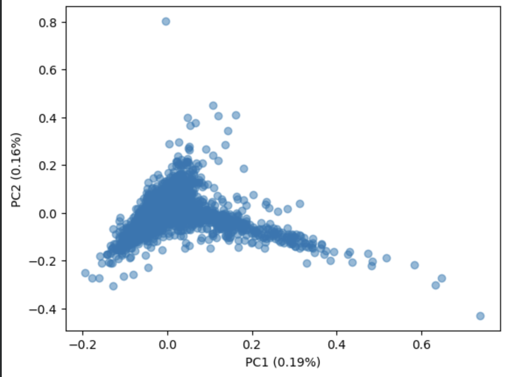

Principle Component Analysis (PCA) Example
------------------------------------------

In data science, data often contains a very high number of dimensions (i.e. columns or parameters), which makes understanding the underlying "shape" of the data difficult. To alleviate this, statisticians and data scientists may choose to project very high-dimensional data into lower-dimensional vector spaces (think: a coordinate plane).

The goal of Principal Component Analysis is to find the axes, given a set number of dimensions, which explain the most variance in the underlying data. In the context of text mining, this is typically done by finding the principal components for the "importance" of words in a corpus of texts. When doing this, every word is its own dimension, and its importance in one text represents the coordinate in that dimension for that piece of text.

By forming principal components, we no longer need to analyze differences between texts using differences in frequencies of every single word in the entire corpus. We can just use differences in principal components, which is not only computationally easier but is also visualizable if you use 2 or 3 dimensions.

--------------------------------------------------------------------------

Importing Necessary Packages

.. code-block :: python

	import butext as bax
	from sklearn.decomposition import PCA
	import pandas as pd
	from sklearn.feature_extraction.text import ENGLISH_STOP_WORDS
	import matplotlib.pyplot as plt

Uploading Dataset

.. code-block :: python

	ntflx = pd.read_csv("https://raw.githubusercontent.com/Greg-Hallenbeck/class-datasets/main/datasets/netflix.csv")
	ntflx

.. code-block :: python

	ntflx["genre"] = ""
	ntflx.loc[ntflx["genres"].str.contains("drama"), "genre"] = "drama"
	ntflx.loc[ntflx["genres"].str.contains("comedy"),"genre"] = "comedy"
	ntflx.loc[ntflx["genres"].str.contains("horror"),"genre"] = "horror"
	ntflx.loc[ntflx["genres"].str.contains("romance"),"genre"] = "romance"
	ntflx.loc[ntflx["genres"].str.contains("documentation"),"genre"] = "documentary"
	ntflx = ntflx.loc[ntflx["genre"] != ""]
	ntflx = ntflx[['id', 'description','type', 'genre']]
	ntflx.head(5)

**Ouput**

.. code-block :: none

		id		description			type	genre
	0	ts300399	This collection includes ...	SHOW	documentary
	1	tm84618		A mentally unstable Vietn...	MOVIE	drama
	2	tm127384	King Arthur, accompanied ...	MOVIE	comedy
	3	tm70993		Brian Cohen is an average...	MOVIE	comedy
	4	tm190788	12-year-old Regan MacNeil...	MOVIE	horror

	

.. code-block :: python

	tokens = (
		ntflx
    		.pipe(bax.tokenize, 'description')
	)
	df = tokens.loc[ ~tokens["word"].isin(ENGLISH_STOP_WORDS) ]

	tfidf = (
		df
   		.groupby('id')['word'].value_counts(normalize = True)
    		.reset_index()
    		.pipe(bax.tf_idf, 'id')
	)
	X = tfidf.pivot(index="id", columns="word",values="tf_idf").fillna(0)

.. code-block :: python

	pca = PCA(n_components=2) 
	X_red = pca.fit(X).transform(X)
	pca.explained_variance_ratio_ 

**Output**

.. code-block :: none

	array([0.00191867, 0.00177301])

.. code-block :: python

	pca_df = pd.DataFrame(X_red, columns=['PC1', 'PC2'], index=X.index)
	plt.scatter(x=pca_df.PC1,y=pca_df.PC2,alpha=0.5)

**Output**

.. image:: _build/html/_static/PCA1.png
	:alt: description
	:width: 400px

There is clearly an outlier in our data which seems to be skewing our PCA. Let's get rid of it.

.. code-block :: python

	X = X.drop(index=pca_df["PC2"].idxmax())
	pca2 = PCA(n_components = 2)
	X_red2 = pca2.fit(X).transform(X)
	pca2.explained_variance_ratio_

**Output**

.. code-block :: none

	array([0.00192173, 0.00158405])

.. code-block :: python

	pca_df2 = pd.DataFrame(X_red2, columns=['PC1', 'PC2'], index=X.index)
	plt.scatter(x=pca_df2.PC1,y=pca_df2.PC2,alpha=0.5)
	plt.xlabel("PC1 (0.19%)")
	plt.ylabel("PC2 (0.16%)")

**Output**

More information can be added by adding the genres to this PCA graph, which can be done by corresponding the IDs to the genres in the original dataframe.

.. code-block :: python

	idgenredf = ntflx[["genre","id"]]
	pca_df_with_id = pca_df2.reset_index()
	pca_df_genres = pd.merge(idgenredf,pca_df_with_id, on="id")
	pca_df_genres

.. code-block :: none

		genre	id	PC1	PC2
	0	documentary	ts300399	0.028289	0.088933
	1	drama	tm84618	-0.003511	0.011684
	2	comedy	tm127384	-0.003055	0.016131
	3	comedy	tm70993	-0.013925	-0.007476
	4	horror	tm190788	-0.037983	-0.014506
	...	...	...	...	...
	5073	comedy	tm1040816	-0.010386	0.011304
	5074	romance	tm1014599	-0.080643	-0.060493
	5075	documentary	tm1108171	0.029668	0.041332
	5076	drama	tm1045018	-0.049197	-0.096247
	5077	comedy	ts271048	0.023657	0.025179

.. code-block :: python

	groups = pca_df_genres.groupby("genre")
	for name, group in groups:
	plt.plot(group.PC1, group.PC2, marker='o', linestyle='', markersize=4,alpha=0.7,label=name)
	plt.xlabel("PC1 (0.19%)")
	plt.ylabel("PC2 (0.16%)")
	plt.legend()
	plt.show()

.. image:: _build/html/_static/PCA2.png
	:alt: description
	:width: 400px

